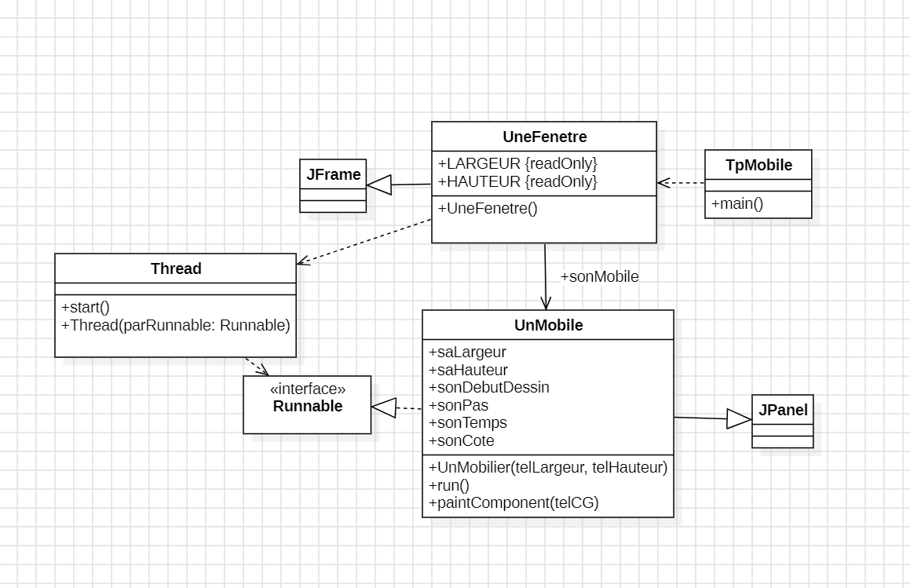
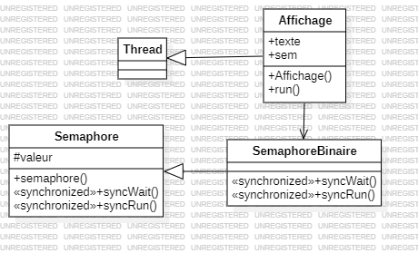

# Rapport et Dossier de Conception
### Ouvrard Maxence INF3-FA

## Introduction

Le présent document a pour objectif de présenter le rapport et la conception des TP réalisés dans le cadre des cours du module Programmation avancée (INR05A). L'objectif de celui-ci est de présenter le cheminement de pensée de chaque TD/TP en présentant la conception permettant la résolution de chaque question.

### Les outils utilisés

Afin de réaliser ce document, les outils utilisés sont les différents supports de cours ainsi que les sujets de TD/TP afin de reprendre les morceaux de codes fournis. De plus, internet est un outil utilisé afin de confimer ou infirmer certaines interrogations. L'utilisation peut être employée mais uniquement dans le cas d'une reformulation de paragraphe. Son utilisation sera notifiée, dans le cas où elle est utilisée dans le document, par un message au dessus du paragraphe retravaillé informatiquement.

## TD Configuration et Architecture Matérielle

L'objectif de ce premier TD est de comprendre de quoi est composé un ordinateur. Quelles sont les différentes parties qui composent un appareil informatique ? Y a-t-il des différences entre les machines ? Si oui, quelles sont-elles ? En regardant les machines de la salle G26 ou encore mon téléphone, nous allons pouvoir répondre à ces différentes questions.

Pour commencer étudions un des ordinateurs de la salle G26, celui-ci se trouvant du côté droit de la salle : 

Nom de l'appareil : G26d-12 \
Nom complet de l’appareil : G26d-12.veli.iut-velizy.uvsq.fr \
Processeur : Intel(R) Core(TM) i7-7700 CPU @ 3.60GHz   3.60 GHz \
Mémoire RAM installée : 32,0 Go (31,9 Go utilisable) \
ID de périphérique : D50C37BE-9C65-4C2E-B9DD-75C9B9C4B650 \
ID de produit : 00378-40000-00001-AA105 \
Type du système	Système d’exploitation 64 bits, processeur x64 \
Stylet et fonction tactile	La fonctionnalité d’entrée tactile ou avec un stylet n’est pas disponible sur cet écran

Info sur le processeurs : 
Nombre de coeurs : 4
Threads : 8
Fréquence : 3.6 Ghz jusqu’à 4.2

Carte graphique : Intel HD graphics 630

Passons maintenant à l'architecture de mon téléphone : 

Version android : 14 \
RAM : 12Go \
CPU : Snapdragon 7s Gen2 Octa-core Max 2.4GHz x64 \
GPU : Qualcomm® Adreno™ \
Stockage : 256Go 

Nous pouvons donc voir ici que malgré les différences d'appareil, nous avons tout de même des similarités. En effet, nous voyons que chacun possède un processeur, de la mémoire (RAM), une carte graphique. Cela fait partie des composants essentiels dans un appareil informatique. 

### De quoi est composé un processeur ?

Dans la description du PC, nous pouvons apercevoir la présence des mots threads et coeurs. Mais à quoi cela correspond ? \
Les processeurs sont des unités permettant de faire des calculs. Afin qu'un pc soit puissant, il est nécessaire qu'il soit capable de réaliser de nombreux calculs en même temps. Le nombre de coeurs représente donc le nombre de tâches que le pc est capable de réaliser en même temps.

Un tread cependant ce sont des instructions qui vont être traitées par le processeur. 

Connaitre ces défénitions et ses principes nous permettent de réfléchir à une nouvelle manière de réfléchir le code, une façon d'utiliser ces différentes méthodes de calculs. Cette méthode se nomme la programmation répartie.

## TD/TP 1 - Thread Java

Dans ce premier TD, l'objectif est de comprendre le fonctionnement des threads en visionnant cela graphiquement. Pour ce faire, le TD nous demande de créer un module qui est dans une fenêtre et qui se déplace de gauche à droite. Nous avons donc les objets fenêtre, Mobile et Thread.

Afin de pouvoir avoir cela, je créé la classe UnMobile abstraction de mon objet mobile. Je crée la classe UneFenetre abstraction de l'objet Fenêtre. Je créé la classe TpMobile abstraction du projet. 

Figure 1 - Diagramme UML de conception du TD1

Sur la figure 1 ci-dessus, nous pouvons voir le domaine du problème ainsi que la conception pour réaliser ce projet. Nous pouvons observer que la classe UneFenetre hérite de la classe JFrame, elle dépend de la classe Thread et est associé à UnMobile dans une relation navigable de UneFenetre vers UnMobile. 
La classe UnMobile dépend de la classe JPanel et utilise l'interface Runnable.

Dans une version plus poussée du projet, plusieurs mobiles sont ajoutés et un verrou MUTEX est mis en place pour créer une section critique dans laquelle un seul mobile peut passer à la fois.

## TD/TP 2 - Sémaphore

Dans ce second TP, l'objectif est de comprendre plusieurs notions comme le verrou MUTEX, les sémaphores, les ressources critiques et les sections critiques. Afin de comprendre cela nous allons donc regarder l'ordre des tâches exécutées par le processeur lors d'un calcul. Pour cela nous allons simuler une section critique, c'est à dire, une zone où seulement un thread peut être exécuté. 

Pour cela, nous allons créer 3 classes, une classe Semaphore abstraction de l'objet Sémaphore, une classe SemaphoreBinaire abstraction de l'objet SemaphoreBinaire et Affichage afin de pouvoir visualiser le problème.

Figure 2 - Diagramme UML de la conception des semaphores

Dans ce diagramme, nous pouvons obeserver que la classe Affichage depend de la classe Thread et qu'un lien d'associativité unique relie la classe Affichage vers SemaphoreBinaire. La classe SemaphoreBinaire dépend de la classe Semaphore.

Après execution de ce code, nous pouvons voir que le sémaphore permet de contrôler la section critique. En donnant à la variable valeur un numéro, elle permet de donner le statut du Thread afin de connaitre son statut, traitée ou non. Cela permet de mettre en attente les Threads qui ne sont pas encore traité. Quand la section critique est libre, un autre Thread peut y aller, ce qui changera son statut et sa valeur.

## TD/TP 3 - Modèle producteur consommateur

