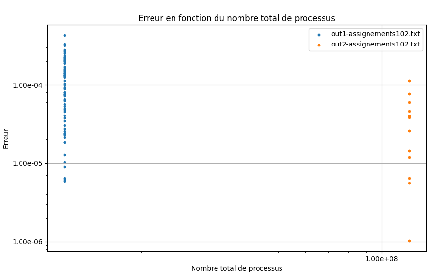

# Rapport et Dossier de Conception
### Ouvrard Maxence INF3-FA

## Introduction

<p style="text-align:justify;">
Le présent document a pour objectif de présenter le rapport et la conception des TP réalisés dans le cadre des cours des modules Programmation avancée (INR05A) et 
Qualité de développement (IN5R08A). L'objectif de celui-ci est de présenter le cheminement de pensée de chaque TD/TP en présentant la conception permettant la résolution de chaque question. Ce rapport a pour but de donner suite au premier rapport et reprend les éléments de cours à partir de la méthode de Monte Carlo.
<p>

### Les outils utilisés

<p style="text-align:justify;">
Afin de réaliser ce document, les outils utilisés sont les différents supports de cours, les notes prises en cours, les sujets de TD/TP afin de reprendre les morceaux de codes fournis et les notes prises en cours, certains points seront appuyés de schéma réalisés en cours. De plus, internet est un outil utilisé afin de confimer ou infirmer certaines interrogations. L'utilisation de l'Intelligence Artificielle a été utilisé afin de corriger les erreurs d'orthographes et peut être employée autrement mais uniquement dans le but d'une reformulation de paragraphe. Pour toute utilisation de reformulation, elle sera notifiée, dans le cas où elle est utilisée dans le document, par un message au dessus du paragraphe retravaillé informatiquement.
</p>

## TD et TP Monte Carlo

<p style="text-align:justify;">

## I. Généralités

<p style="text-align:justify;">
La méthode de Monte Carlo est une technique qui utilise des simulations aléatoires pour résoudre des problèmes compliqués. L’idée principale est de répéter plusieurs fois une expérience aléatoire et de tirer une estimation du résultat recherché. Ici, nous allons chercher une estimation de pi, en cherchant à savoir combien de points tombent dans la surface d'un arc de cercle dans un plan.
</p>
<p style="text-align:justify;">
Dans le domaine scientifique, cette méthode est présente dans de nombreuses disciplines. En physique, elle permet de simuler le comportement des particules en mécanique quantique ou en physique nucléaire. En finance, elle sert à prévoir l’évolution des marchés et à évaluer les risques des investissements. Elle est aussi appliquée en ingénierie, notamment pour tester la fiabilité des structures comme les ponts ou les avions face aux aléas extérieurs. Ce ne sont que quelques exemples parmi tant d'autres.
</p>
<p style="text-align:justify;">
Dans les casinos, la méthode de Monte Carlo est utilisée pour analyser les probabilités de gains dans des jeux comme la roulette, le poker ou les machines à sous. Elle permet aussi d’optimiser certaines stratégies de jeu, en testant des milliers de scénarios pour voir quelles décisions donnent les meilleurs résultats à long terme.
</p>

A présent penchons nous sur la méthode de Monte Carlo pour calculer pi.


Figure 1 - Modélisation de Pi Monte Carlo

Pour $\pi$ :

$d = \sqrt{x^2 + y^2}$

$\pi \approx \frac{x}{r} \cdot \frac{y}{r} \cdot n$

La probabilité que $x_p$ soit dans le cercle est : p = $\frac{\frac{\pi r²} {4}} {r²}$ = $\frac{\pi} {4}$

Soit $\pi$ à la n-ième. Soit $P(x_p | d_p <= r)$.

Soit un carré de côté $1$, soit un quart de disque de rayon $r = 1$. L'aire du carré s'écrit : Ac = r² = 1

L'aire du quart de disque s'écrit : $A_\frac{d} {4}$ = $\frac{\pi r²} {4} = \frac{\pi} {4}$

La figure 1 illustre le tirage aléatoire de points $x_p$ de coordonnées $(x_p, y_p)$ où $x_p$ et $y_p$ suivent une loi $U(]0, 1[)$.

La probabilité qu'un point $x_p$ soit dans le quart de disque est :  p($x_p | d_p$ < 1) = $\frac{\pi} {4}$

On effectue $n\_total$ tirs. Si $n\_total$ est grand alors on approche : p($x_p | d_p$ < 1) $ \approx \frac{n\_cible}{n\_total}$ avec $n\_cible$ le nombre de points dans la cible.

On peut approcher $\pi$ par : $\pi$ = 4*$\frac{n\_cible}{n\_total}$

On écrit l'algorithme permettant de calculer $\pi$ de cette manière :
</p>

**Algorithme 1 :**

```text
cmpt = 0
point = 0
tant que point < nb_point
    x = aléatoire(0,1)
    y = aléatoire(0,1)
    si x^2 + y^2 <= 1 alors
        cmpt++
    point++
fin tant que
point = (cmpt / nb_point) * 4
```
<p style="text-align:justify;">
Ce code commence par initialiser deux variables : cmpt pour compter le nombre de points qui tombent dans le quart de cercle et point pour suivre le nombre total de points générés. Tant que le nombre de points générés est inférieur au nombre total de points souhaité, le code génère un point aléatoire avec des coordonnées x et y dans un carré de dimension 1, où chaque coordonnée est entre 0 et 1. Ensuite, il vérifie si le point tombe dans le quart de cercle. Si c’est le cas, il incrémente le compteur cmpt. Une fois que tous les points ont été générés, le code calcule l'estimation de pi.
La complexité de ce programme dépend du nombre de points souhaité.
</p>

## II. Parallélisation

<p style="text-align:justify;">
Dans cette partie, nous allons chercher à paralléliser l'algorithme pour calculer pi avec la méthode de Monte Carlo. Pour ce faire, nous allons réaliser un descriptif des tâches, puis nous chercherons à faire plusieurs nouveaux algorithmes afin de trouver la méthode qui semble la plus optimisé en parallélisation.
</p>

Débutons la parallélisation :

On choisit un modèle de parallélisme de tâches.

- Tâches :
  - Générer des points
  - Calcul des points dans le cercle
  - Calcul de Pi
- Sous-tâches :
  - Initialiser les valeurs
  - Générer x
  - Générer y
  - Vérifier si c'est dans le cercle
  - Calculer pi
  

Algorithme 2 :

```text
boucle parallèle de 0 à n_total
    x = aléatoire(0,1)
    y = aléatoire(0,1)
    si x^2 + y^2 <= 1 alors
        n_cible++
    fin si
fin boucle parallèle
pi = (n_cible / n_total) * 4
```
Le code ci-dessous, l'algorithme 2, présente une version parallélisée de l'algorithme 1. Mais comment avons nous réussi à paralléliser ce programme ? 

Pour cela nous avons créer trois choses : une boucle parallèle, une section critique et une ressource critique. 

La boucle parallèle, clairement indiquée dans l'algorithme, permet à plusieurs itérations de pouvoir s'exécuter en même temps. 

La section critique correspond à l’incrémentation de n_cible, qui est une opération partagée entre plusieurs itérations de la boucle parallèle. Comme plusieurs threads peuvent tenter de modifier cette variable simultanément.

La ressource critique est la variable n_cible, qui stocke le nombre total de points tombant à l’intérieur du quart de cercle. Puisqu’elle est partagée entre toutes les instances parallèles du programme, c'est cette ressource qui créé la section critique.

Algorithme 3:

```text
boucle parallèle de 0 à n_total/100
    boucle de 0 à 100
        x = aléatoire(0,1)
        y = aléatoire(0,1)
        si x^2 + y^2 <= 1 alors
            n_cible++
        fin si
    fin boucle
fin boucle
pi = (n_cible / n_total) * 4
```
Le code ci-dessus, l'algorithme 3, présente une version parallélisée de l'algorithme 1. 

Nous avons créé, comme pour l'algorithme 2, trois choses : une boucle parallèle, une section critique et une ressource critique.

La boucle parallèle, permet toujours d’exécuter plusieurs itérations simultanément à la seule différence ici que chaque itération de cette boucle génère 100 points aléatoires, au lieu de un seul, et vérifie s’ils appartiennent au quart de cercle unité.

La section critique correspond à l’incrémentation de n_cible, qui compte le nombre total de points à l'intérieur du cercle.

La ressource critique est la variable n_cible.

Cette version permet de réduire les accès concurrents à la ressource critique.

Le Master Worker :

Tout d'abord, rappelons ce qu'est le paradigme Master/Worker et comment il fonctionne. Le paradigme Master-Worker est un modèle de programmation parallèle où le Master divise le travail en plusieurs tâches et les distribue aux Workers.

Les Workers exécutent ces tâches indépendamment et renvoient les résultats au Master.

Le Master récupère, combine et finalise les résultats.

Voici un dessin montrant comment fonctionne ce paradigme :


Figure 2 - Modélisation de l'exécution du paradigme Master/Worker

Sur ce schéma, nous pouvons observer que le master est seul et qu'il envoie à plusieurs Worker des données et tâches à réaliser. Une fois ces tâches réalisées par les Workers, ils les renvoient vers le Master qui récolte les données calculées.

Voici le code : 

```text
nb_workers = 100
nb_point = n_total / nb_workers
ncible[nb_workers]
boucle pour de i allant de 0 à nb_point-1
    xi = aléatoire(0,1)
    yi = aléatoire(0,1)
    si dans quart de cercle
      ncible[k]++
    fin si
fin boucle pour
n_cible = sum(ncibles);
pi = 4 * n_cible / n_tot;
```

Chaque worker génère des points et compte ceux qui sont présent dans l'arc de cercle.
On effectue une réduction parallèle pour sommer les résultats.
Enfin, π est calculé à partir du rapport des points dans le cercle.
Ce code est plus efficace que les autres car chaque worker effectue des calculs indépendants, et seule l'opération de somme nécessite une synchronisation.

## III. Mise en oeuvre

Maintenant que nous avons vu comment nous pouvions optimiser le code de Monte Carlo pour calculer Pi en le parallélisant, nous allons nous pencher sur la conception de deux fichiers : Pi.java et Assignment102.java.

### Analyse PiMonteCarlo.java


Figure 3 - Graphe UML de PiMonteCarlo.java

Voici ce qu'il se passe dans le code :

- **Initialisation** :
  - `PiMonteCarlo` initialisé avec `nThrows` (nombre total de points).
  - `nAtomSuccess` compte les points dans un quart de cercle.

- **Génération de Points** :
  - Classe `MonteCarlo` génère des points aléatoires `(x, y)`.
  - Incrémente `nAtomSuccess` si `x² + y² ≤ 1`.

- **Exécution Concurrente** :
  - `getPi` utilise tous les processeurs pour exécuter `MonteCarlo`.
  - Attend la fin des tâches.

- **Calcul de π** :
  - Estime π avec `4 * (succès / total)`.

- **Retour de la Valeur** :
  - Retourne la valeur estimée de π.

### Analyse Assigment102.java

Voici ce qu'il se passe dans le code :

- **Initialisation** :
  - `PiMonteCarlo` est initialisé avec `nThrows`, qui représente le nombre total de points à générer, et `nProcessors`, le nombre de processeurs à utiliser pour le calcul parallèle.
  - `nAtomSuccess` est un compteur qui sert à suivre le nombre de points tombant à l'intérieur d'un quart de cercle.

- **Génération de Points** :
  - La classe `MonteCarlo`, qui implémente `Runnable`, génère des points aléatoires `(x, y)` dans un carré unité.
  - Pour chaque point, elle vérifie si `x² + y² ≤ 1`. Si c'est le cas, le point est à l'intérieur du quart de cercle, et `nAtomSuccess` est incrémenté.

- **Exécution Concurrente** :
  - La méthode `getPi` crée un `ExecutorService` avec un pool de threads utilisant tous les processeurs disponibles pour exécuter les instances de `MonteCarlo`.
  - Chaque instance de `MonteCarlo` est soumise comme une tâche à l'`ExecutorService`, qui les exécute en parallèle.
  - Le programme attend que toutes les tâches soient terminées avant de continuer.

- **Calcul de π** :
  - Une fois toutes les tâches complétées, la valeur de π est estimée en utilisant la formule `4 * (nAtomSuccess / nThrows)`.
  - Cette formule est basée sur le rapport entre les points à l'intérieur du quart de cercle et le nombre total de points générés.

- **Retour de la Valeur** :
  - La méthode `getPi` retourne la valeur estimée de π.
  - Le programme principal affiche cette valeur ainsi que l'erreur par rapport à la valeur réelle de π, et écrit ces informations dans un fichier.

**Différences avec pi.java** :

  ....


## IV. Calcul de performances

Nous venons de définir les conceptions de différents codes parallèles, mais dans le cadre du cours Qualité de Développement et dans l'intérêt de comprendre quelle est la méthode la plus fiable pour calculer pi avec la méthode de Monte Carlo, nous allons réaliser le calcul de performance des différents code.

Mais comment fait on pour calculer et comparer les performances ?


Figure 4 - Speedup (extrait du cours F. Butelle et C. Coti, U. P13)

Afin de réaliser nos calculs, nous allons faire des calculs de scalabilité forte et faible.

Scalibité forte : méthode d'évaluation des performances d'un programme en augmentant des processeurs ou ressources en laissant constant le nombre de processus. L'objectif est de mesurer la vitesse du système en fonction du nombre de processus.

Scalabité faible : à l'inverse, cette méthode permet d'évaluer les performances d'un programme en augmentant les processus et en augmentant aussi le nombre de processeurs ou de ressources disponibles. L'objectif est de messurer l'impact de codes et problèmes plus gros.

Enfin pour comparer, nous pourrons observer la moyenne des erreurs observés lors de la scablabilité forte.

Pour rappel, tous les calculs sont effectués sur une machine avec les composants suivants :

- Processeur : Intel(R) Core(TM) i7-7700 CPU @ 3.60GHz   3.60 GHz
- Mémoire RAM installée : 32,0 Go (31,9 Go utilisable)
- Nombre de coeurs : 4
- Threads : 8
- Fréquence : 3.6 Ghz jusqu’à 4.2
- Carte graphique : Intel HD graphics 630

Commençons par calculer la scalabilité forte et faible de Pi.java. Pour cela, nous allons réaliser les tests suivants :

| **Nombre de processeurs** | **Nombre total de points** | **Points par processeur** |  
|---------------------------|----------------------------|---------------------------|  
| 1                         | 12 000 000                 | 12 000 000                |  
| 2                         | 12 000 000                 | 6 000 000                 |  
| 3                         | 12 000 000                 | 4 000 000                 |  
| 4                         | 12 000 000                 | 3 000 000                 |  
| 6                         | 12 000 000                 | 2 000 000                 |
| 12                        | 12 000 000                 | 1 000 000                 | 
| 1                         | 120 000 000                | 120 000 000               |  
| 2                         | 120 000 000                | 60 000 000                |  
| 3                         | 120 000 000                | 40 000 000                |  
| 4                         | 120 000 000                | 30 000 000                | 
| 6                         | 120 000 000                | 20 000 000                |  
| 12                        | 120 000 000                | 10 000 000                |  
| 1                         | 1 200 000 000              | 1 200 000 000             |  
| 2                         | 1 200 000 000              | 600 000 000               |  
| 3                         | 1 200 000 000              | 400 000 000               | 
| 4                         | 1 200 000 000              | 300 000 000               |  
| 6                         | 1 200 000 000              | 200 000 000               |  
| 12                        | 1 200 000 000              | 100 000 000               |  

Voici la courbe que nous ont données nos valeurs :


Figure 5 - Scalabité forte de Pi.java

Ici nous pouvons voir que plus l'expérience possède de points, plus le speedup va se rapprocher du speedup linéaire.


Figure 6 - Scalabilité Faible de Pi.java

Passons à présent à Assignment102.java. Pour ce code là, nous allons réaliser des tests jusqu'à 120 000 000 points :

| **Nombre de processeurs** | **Nombre total de points** | **Points par processeur** |  
|---------------------------|----------------------------|---------------------------|  
| 1                         | 12 000 000                 | 12 000 000                |  
| 2                         | 12 000 000                 | 6 000 000                 |  
| 3                         | 12 000 000                 | 4 000 000                 |  
| 4                         | 12 000 000                 | 3 000 000                 |  
| 6                         | 12 000 000                 | 2 000 000                 |
| 8                         | 12 000 000                 | 1 500 000                 |
| 10                        | 12 000 000                 | 1 200 000                 |
| 12                        | 12 000 000                 | 1 000 000                 | 
| 1                         | 120 000 000                | 120 000 000               |  
| 2                         | 120 000 000                | 60 000 000                |  
| 3                         | 120 000 000                | 40 000 000                |  
| 4                         | 120 000 000                | 30 000 000                | 
| 6                         | 120 000 000                | 20 000 000                |
| 8                         | 120 000 000                | 15 000 000                | 
| 10                        | 120 000 000                | 12 000 000                |   
| 12                        | 120 000 000                | 10 000 000                |  


Figure 7 - Scalabilité forte de Assignements102.java

Ici, nous pouvons constater que Pi.java est fortement plus efficace. En effet, ici la courbe descend directement ou stagne alors que pour Pi.java, la courbe augmente fortement avant de stagner.


Figure 8 - Scalabilité faible de Assignements102.java

## V. Analyse des erreurs

Dans cette partie, nous allons nous intéresser à l'analyse des erreurs dans les différents codes testés auparavant.


Figure 9 - Erreur de Pi.java

Dans cette figure, le out-pi1 correspond au fichier avec 120 000 000 points, le fichier out-pi2 avec 1 200 000 000 points et le dernier avec 12 000 000 points. Une fois cela connu, nous pouvons constater que plus il y a de point, moins l'erreur est grande. En effet, car plus l'expérience est grande, plus la précision le sera aussi.



Figure 10 - Erreur de Assignements102.java

Pour le cas de Assignements102, nous pouvons constater que les erreurs sont sensiblement les mêmes que pour Pi.java.

## VI. Socket

Dans cette partie, nous allons nous intéresser à une nouvelle version de la méthode de Monte Carlo en Master / Worker. L'objectif est de faire communiquer par une ip et un port les master / worker afin de réaliser une plus grosse expérience plus tard. Ici, tous les worker seront lancés sur une même machine.

### Analyse MasterSocket.java

#### 1. Initialisation
- Le master demande combien de workers (processus) seront utilisés et ouvre un socket pour chacun.

#### 2. Distribution des Tâches
- Chaque worker reçoit le nombre total de points à générer pour estimer π.

#### 3. Calcul par les Workers
- Les workers génèrent des points aléatoires dans un carré, comptent ceux qui tombent dans un quart de cercle, et renvoient leurs résultats au master.

#### 4. Collecte des Résultats
- Le master récupère les résultats des workers et les combine pour estimer π.

#### 5. Affichage des Résultats
- Le master affiche la valeur de π, l'erreur relative, et les statistiques de performance.

#### 6. Fermeture
- Les sockets entre le master et les workers sont fermés proprement après la simulation.

### Analyse WorkerSocket.java

#### Initialisation 
  - Le worker s'initialise en configurant un socket serveur sur un port spécifié. Il attend une connexion du master.

#### Distribution des Tâches 
- Le worker lit le nombre total de points à générer à partir du master.

#### Calcul 
- Le worker calcule le nombre de points qui tombent dans un quart de cercle en utilisant la méthode de Monte Carlo.

#### Collecte des Résultats
- Le worker envoie le résultat calculé au master.

#### Affichage des Résultats 
- Cette étape est gérée par le master, qui collecte et affiche les résultats finaux.

#### Fermeture des Connexions
- Après le calcul et l'envoi des résultats, le worker ferme tous les sockets et flux pour libérer les ressources.

### Calcul de performances

Passons aux expériences de performances pour WorkerSocket :

| **Nombre de processeurs** | **Nombre total de points** | **Points par worker**     |  
|---------------------------|----------------------------|---------------------------|  
| 1                         | 12 000 000                 | 12 000 000                |  
| 2                         | 12 000 000                 | 6 000 000                 |  
| 3                         | 12 000 000                 | 4 000 000                 |  
| 4                         | 12 000 000                 | 3 000 000                 |  
| 6                         | 12 000 000                 | 2 000 000                 |
| 8                         | 12 000 000                 | 1 500 000                 |
| 10                        | 12 000 000                 | 1 200 000                 |


Figure 11 - Scalabilité forte de WorkerSocket.java

Pour la scalabilité forte de WorkerSocket, on peut voir que la courbe suit fortement la courbe jusqu'à 4 workers mais après la courbe s'éloigne de plus en plus avant de s'effondrer. On peut considérer cela car le processeur a seulement 4 coeurs logiques, donc une fois passer 4 workers, les coeurs sont utilisés par plusieurs processus en même temps.


Figure 12 - Scalabilité faible de WorkerSocket.java

### Analyse des erreurs

Passons à présent à l'analyse des erreurs de WorkerSocket.


Figure 13 - Erreur de WorkerSocket.java

## VII. Monte Carlo en machine distribué

Dans cette partie, nous allons réaliser un projet avec plus d'ampleur. L'objectif final est de réussir à lancer le projet Master / Worker dans un environnement distribué. Pour cela, nous allons utiliser un Master et plusieurs Worker qui ont tous la même architecture, et qui ne lanceront que ce programme.

### Analyse du code distribuée

Dans cette partie, nous allons aborder le même code qu'au dessus mais appliqué à un environnement distribué, c'est à dire sur plusieurs machines. Ici le code a été adapté pour pouvoir communiquer avec les différentes machines de la G26 en prenant en compte une liste d'IP sur lequel envoyer le travail qui doit être effectué par les worker.

### Calcul des performances

Voici le résultat des expériences réalisés lors de la dernière séance :


Figure 14 - Scalabilité forte de WorkerSocket en version distribuée


Figure 15 - Scalabilité faible de WorkerSocket en version distribuée

## VII. Les normes ISO

ATTENTION : Utilisation de l'IA dans un but de reformulation

Dans cette partie dédiée à la Qualité de Développement, nous allons nous intéresser aux normes ISO et IEC.

Tout d'abord, qu'est ce qu'une norme ISO ?

Une norme ISO/IEC est un document établi par l'Organisation internationale de normalisation et la Commission électrotechnique internationale qui spécifie des exigences, ou des caractéristiques pour des produits, des processus ou des services. Ces normes sont élaborées par des experts techniques de comités internationaux et visent à fournir des solutions consensuelles aux exigences du marché mondial. Elles sont conçues pour être utilisées de manière volontaire et servent de référence pour l'amélioration continue de la qualité, de la sécurité, de la fiabilité et de l'interopérabilité des produits et services.

Les normes ISO/IEC sont présentes dans de nombreux secteurs, comme la technologie de l'information, les systèmes de gestion, l'ingénierie, ou encore la santé. Elles sont souvent adoptées par les entreprises et les organisations pour démontrer leur conformité aux meilleures pratiques internationales et pour faciliter le commerce international.

Qu'est ce que la norme ISO 25010 ?

La norme ISO/IEC 25010 définit un modèle de qualité des produits applicable aux produits de technologie de l'information et de la communication et aux produits logiciels. Ce modèle se compose de neuf caractéristiques de qualité qui concernent les propriétés de qualité des produits. Il sert de référence pour spécifier, mesurer et évaluer la qualité des produits tout au long de leur cycle de vie. Les parties prenantes, y compris les développeurs, le personnel de l'assurance qualité et les évaluateurs indépendants, peuvent utiliser ce modèle pour diverses activités telles que la définition des exigences, l'identification des objectifs de conception, les tests, le contrôle de la qualité et l'établissement de critères d'acceptation. L'utilisation de cette norme permet aux clients comme aux entreprises d'avoir une base saine et d'avoir un produit qui convient à tous les parties.

Qu'est ce que la norme IEC 25022 ?

La norme ISO/IEC 25022 propose un ensemble de mesures de qualité en utilisation à utiliser avec le modèle de qualité en utilisation défini dans l'ISO/IEC 25010. Elle fournit des mesures de base pour chaque caractéristique de qualité en utilisation et explique comment mesurer cette qualité. Ces mesures sont applicables à tout système homme-ordinateur et sont principalement destinées à être utilisées pour l'assurance qualité et la gestion des systèmes et produits logiciels en fonction de leurs effets réels lors de leur utilisation. Les principaux utilisateurs de ces mesures sont les personnes impliquées dans le développement, l'acquisition, l'évaluation ou la maintenance des logiciels et systèmes.

## Conclusion

Pour conclure, ce rapport, nous avons analysé en profondeur la méthode de Monte Carlo appliquée à l'estimation de π, en étudiant différentes implémentations et optimisations via la parallélisation et la distribution des calculs. Nous avons comparé plusieurs algorithmes, du séquentiel aux modèles parallèles et distribués, notamment via le paradigme Master/Worker et l'utilisation de sockets.

Les tests de performances ont montré que la parallélisation améliore significativement l'efficacité du calcul, bien que l'optimisation certains programme aient une efficacité légerement supérieur au séquentiel. Nous avons pu observer que le paradigme Master/Worker en version distribuée était la plus efficace dans ce contexte. Malgré tout, la méthode de Monte Carlo reste une méthode qui n'est pas efficace pour approximer pi de manière très précise. Nous pourrions ajouter un nombre de points bien supérieur à 64 milliards, nous resterions avec une très grande erreur par rapport à pi.

Enfin, nous avons abordé les normes ISO/IEC relatives à la qualité logicielle, soulignant l'importance d'un développement conforme aux standards pour assurer fiabilité et maintenabilité. Cela nous a permis de définir et de comprendre quels outils ont les développeurs et les clients afin de rendre leurs produits conformes.

Ce rapport ouvre la voie sur une méthode de développement qui devraient être la norme d'ici une dizaine d'années.